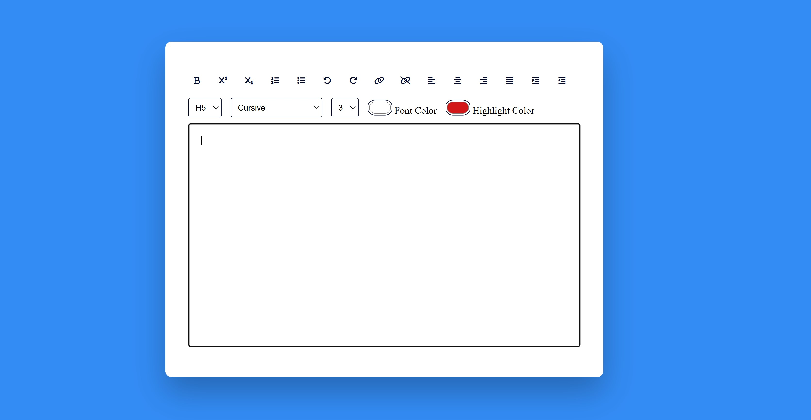

# Javascript Text Editor



## Descripción

Este proyecto es un editor de texto interactivo desarrollado con **HTML**, **CSS** y **JavaScript**. Incluye múltiples herramientas de formato y opciones de personalización para crear y editar texto directamente desde el navegador.

Puedes probar la aplicación en vivo aquí: [Javascript Text Editor](https://saitamaprogramer.github.io/Javascript-Text-Editor/)

## Características

- **Formatos de texto:** Aplicar negrita, subíndice, superíndice y encabezados (H1-H6).
- **Listas:** Crear listas ordenadas y desordenadas.
- **Alineación:** Ajustar texto a la izquierda, derecha, centrado o justificado.
- **Colores:** Cambiar el color del texto y el resaltado.
- **Enlaces:** Insertar o eliminar enlaces personalizados.
- **Deshacer y rehacer:** Revertir o rehacer cambios fácilmente.
- **Personalización de fuentes:** Elegir el tipo y tamaño de fuente deseados.

## Tecnologías utilizadas

- **HTML:** Para la estructura del contenido.
- **CSS:** Para los estilos y el diseño visual.
- **JavaScript:** Para la lógica del editor y la interacción con el DOM.

## Instalación y uso

1. Clona este repositorio en tu máquina local:

   ```bash
   git clone https://github.com/saitamaprogramer/Javascript-Text-Editor.git
Navega a la carpeta del proyecto:

bash
Copiar
Editar
cd Javascript-Text-Editor
Abre el archivo index.html en tu navegador:

bash
Copiar
Editar
open index.html
¡Comienza a editar y personalizar texto con las herramientas interactivas!

Estructura del proyecto
bash
Copiar
Editar
📁 Javascript-Text-Editor
├── index.html       # Archivo principal del proyecto
├── style.css        # Archivo de estilos
├── script.js        # Archivo con la lógica del editor
└── text-editor.jpg  # Imagen de vista previa
Captura de pantalla

Cómo contribuir
Si deseas contribuir al proyecto, sigue estos pasos:

Haz un fork del repositorio.

Crea una nueva rama para tus cambios:

bash
Copiar
Editar
git checkout -b nueva-funcionalidad
Realiza tus cambios y realiza un commit:

bash
Copiar
Editar
git commit -m "Descripción breve de los cambios"
Sube los cambios a tu repositorio:

bash
Copiar
Editar
git push origin nueva-funcionalidad
Crea un pull request desde GitHub.

Créditos
Este proyecto fue desarrollado por SaitamaProgramer como un ejercicio práctico para trabajar con herramientas de edición de texto en el navegador.
